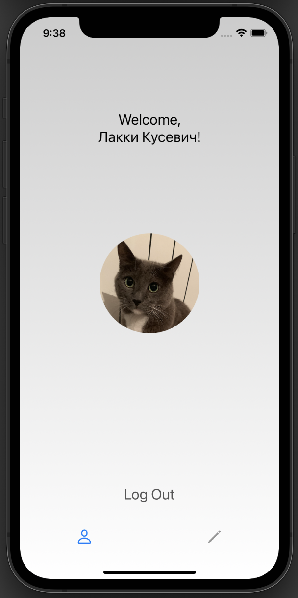

# LoginApp

Приложение с личным профилем котика Лакки.

# Интерфейс
1. Экран для ввода логина (User) и пароля (12345). В случе некорректного ввода логина/пароля высвечивается соответствующее собщение об ошибке. 
Посмотреть корректные логин и пароль можно тапнув по соотвествующим кнопкам на экране:

2. Экран приветствия с функцией выхода из личного профиля:

3. Экран с кнопкой, благодаря которой осуществляется переход к профилю с более подробной информайей о котике:

4. Экран c фотографией котика и его личной инофрмацией:

# Используемый стек технологий
- Язык программирования - `Swift`
- Архитектура - `MVC`
- Интерфейс - `UIKit` (исп. TabBarController, NavigationController)
- iOS 13+
